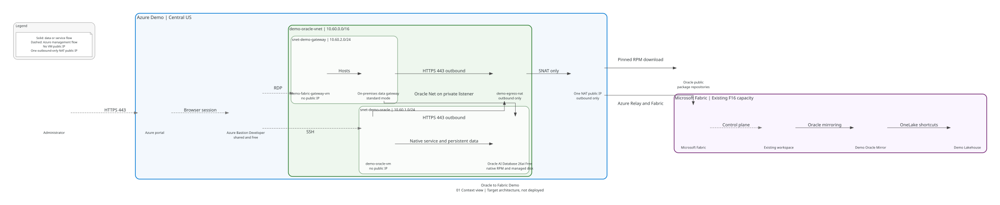
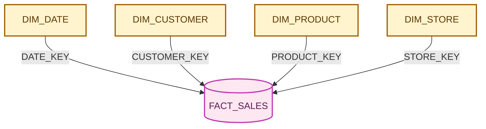
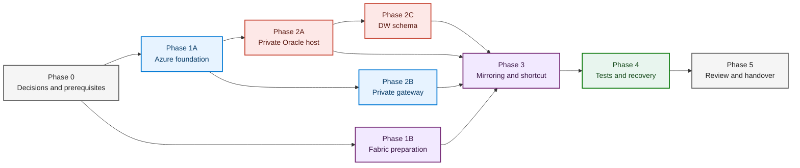

# Oracle Database Free to Microsoft Fabric

This repository will host a private Azure demonstration environment. Oracle AI Database Free will run on an Azure VM, a small star schema will be mirrored into Microsoft Fabric, and the replicated tables will be exposed in a Lakehouse.

> Status on September 14, 2026: development plan only. No Azure or Fabric resource has been deployed.

## Rendered architecture

The primary diagram is generated with Python Diagrams and Graphviz. It uses Azure service icons and the official Microsoft Fabric icons.

[](docs/architecture/rendered/01-context.svg)

The architecture pack separates context, network topology, security flows, and data flows so that each view remains readable.

| View | SVG | PNG | PDF | Source |
| --- | --- | --- | --- | --- |
| Context | [Open](docs/architecture/rendered/01-context.svg) | [Open](docs/architecture/rendered/01-context.png) | [Open](docs/architecture/rendered/01-context.pdf) | [`01_context.py`](docs/architecture/diagrams/01_context.py) |
| Network topology | [Open](docs/architecture/rendered/02-network-topology.svg) | [Open](docs/architecture/rendered/02-network-topology.png) | [Open](docs/architecture/rendered/02-network-topology.pdf) | [`02_network_topology.py`](docs/architecture/diagrams/02_network_topology.py) |
| Security flows | [Open](docs/architecture/rendered/03-security-flows.svg) | [Open](docs/architecture/rendered/03-security-flows.png) | [Open](docs/architecture/rendered/03-security-flows.pdf) | [`03_security_flows.py`](docs/architecture/diagrams/03_security_flows.py) |
| Data flows | [Open](docs/architecture/rendered/04-data-flows.svg) | [Open](docs/architecture/rendered/04-data-flows.png) | [Open](docs/architecture/rendered/04-data-flows.pdf) | [`04_data_flows.py`](docs/architecture/diagrams/04_data_flows.py) |

The [architecture inventory](docs/architecture/architecture-inventory.yaml) records confirmed facts, assumptions, traffic flows, and unresolved deployment values. The diagrams describe a target state, not a deployed environment.

## Architecture decisions

| Topic | Decision |
| --- | --- |
| Oracle image | Use the official Oracle AI Database 26ai Free container image from Oracle Container Registry, pinned to an exact version and digest. |
| Host | Run the container on an x64 Oracle Linux VM with a dedicated managed data disk. The VM will have no public IP address. |
| Administration | Use Azure Bastion Premium in private-only mode. Local access will use point-to-site VPN or ExpressRoute and the Bastion native client. |
| Oracle network | Oracle will listen only on its private address. Oracle Net will be allowed from the Fabric gateway subnet, never from the Internet. |
| Outbound access | Use NAT Gateway for the PoC, or Azure Firewall when FQDN filtering and centralized traffic logs are required. |
| Fabric connection | Install a standard on-premises data gateway on a dedicated Windows VM in the VNet. This is the currently supported path for Oracle Mirroring. |
| Fabric destination | A Mirrored Database will replicate Oracle tables into OneLake and provide a SQL analytics endpoint. |
| Lakehouse | A OneLake shortcut will expose the Mirrored Database tables in the Lakehouse without creating a second copy. |
| Fabric Private Endpoint | It does not replace the Oracle gateway. Fabric Private Link is a separate decision for private access to Fabric interfaces. |
| Intended use | Oracle AI Database Free is suitable for this PoC. A production workload requires a supported and patched Oracle edition. |

The supplied Oracle page is not an Azure Marketplace VM image. The plan uses an Oracle Linux image from Azure Marketplace, then runs the official `container-registry.oracle.com/database/free` image with Podman. The VM will pull the image through controlled outbound access. The image will not be copied into Azure Container Registry until the Oracle terms have been reviewed for that use.

## Editable Mermaid architecture

The rendered diagrams above are the presentation views. The Mermaid diagrams below remain useful for quick review and lightweight edits in GitHub.

```mermaid
flowchart LR
    Admin[Administration workstation]
    PrivateAccess[P2S VPN or ExpressRoute]

    subgraph Azure["Azure tenant"]
        subgraph VNet["Private VNet"]
            Bastion[Azure Bastion Premium<br/>private-only]

            subgraph OracleSubnet["Oracle subnet"]
                OracleVM[Oracle Linux VM<br/>no public IP]
                OracleDB[(Oracle AI Database 26ai Free<br/>container and managed disk)]
                OracleVM --> OracleDB
            end

            subgraph GatewaySubnet["Data gateway subnet"]
                GatewayVM[Dedicated Windows VM<br/>no public IP]
                OPDG[On-premises data gateway<br/>Oracle Client for Microsoft Tools]
                GatewayVM --> OPDG
            end

            Egress[Controlled outbound access<br/>NAT Gateway or Azure Firewall]
            KeyVault[Key Vault<br/>Private Endpoint]
        end
    end

    subgraph Fabric["Microsoft Fabric"]
        Workspace[Fabric capacity workspace]
        Mirror[(Mirrored Database)]
        SQLEndpoint[SQL analytics endpoint]
        Lakehouse[(Lakehouse)]
        Workspace --> Mirror
        Mirror --> SQLEndpoint
        Mirror -->|OneLake shortcut| Lakehouse
    end

    Admin --> PrivateAccess --> Bastion
    Bastion -->|Private SSH| OracleVM
    Bastion -->|Private RDP| GatewayVM
    OPDG -->|Private Oracle Net| OracleDB
    OracleVM -->|Initial pull and updates| Egress
    OPDG -->|Outbound HTTPS and Azure Relay| Egress
    Egress --> Workspace
    OracleVM --> KeyVault
    GatewayVM --> KeyVault

    classDef oracle fill:#FDE8E7,stroke:#C74634,color:#5B1A12,stroke-width:2px;
    classDef azure fill:#E7F3FF,stroke:#0078D4,color:#083B66,stroke-width:2px;
    classDef security fill:#E8F5EE,stroke:#107C10,color:#164B1B,stroke-width:2px;
    classDef fabric fill:#F2E9FF,stroke:#742774,color:#3B1747,stroke-width:2px;
    classDef neutral fill:#F5F5F5,stroke:#616161,color:#212121,stroke-width:1px;

    class OracleVM,OracleDB oracle;
    class Bastion,GatewayVM,OPDG azure;
    class PrivateAccess,Egress,KeyVault security;
    class Workspace,Mirror,SQLEndpoint,Lakehouse fabric;
    class Admin neutral;
```



The colors identify technical ownership: red for Oracle, blue for Azure resources, green for network controls, and purple for Fabric.

### Why the design uses a gateway instead of a Private Endpoint

Oracle runs on a VM with a private network interface. It does not need an Azure Private Endpoint to remain private.

Oracle Mirroring in Fabric currently supports the on-premises data gateway. The gateway connects to Oracle over the private VNet, then initiates outbound connections to Azure Relay and Fabric. It requires no inbound Internet port.

The following services are not used as the Oracle replication path:

- VNet data gateway, which is not documented as supported for Oracle Mirroring
- Fabric managed private endpoints, which do not replace the on-premises data gateway in this scenario
- Fabric Private Link, which protects access to Fabric interfaces but does not provide the Oracle source connection

Fabric Private Link remains a separate gate. Gateway registration or recovery can require specific sequencing when tenant-level Private Link is enabled.

## Planned network layout

| Subnet | Purpose | Allowed traffic |
| --- | --- | --- |
| `AzureBastionSubnet` | Bastion Premium private-only, `/26` or larger | Private HTTPS from the administration network, then SSH and RDP to target VMs |
| `snet-oracle` | Oracle Linux VM and Oracle Database Free | Oracle Net from `snet-gateway`, SSH from Bastion, controlled outbound access for the image and updates |
| `snet-gateway` | Windows VM and on-premises data gateway | Oracle Net to `snet-oracle`, RDP from Bastion, outbound HTTPS and Azure Relay |
| `snet-private-endpoints` | Key Vault and future private PaaS endpoints | Private DNS resolution and access from approved VMs |
| `GatewaySubnet` | Azure VPN Gateway when point-to-site VPN is selected | Encrypted access from the administration workstation |

All workload subnets will be private and will use an explicit outbound method. Azure VNets created with API versions after March 31, 2026 use private subnets by default.

A point-to-site VPN gateway still exposes an authenticated public VPN endpoint. If the policy forbids every public endpoint, not only public workload access, the administration path must use private connectivity such as ExpressRoute.

### Security rules

- no public IP address on either VM network interface
- no Internet ingress for SSH, RDP, or Oracle Net
- Oracle Net allowed only from the Fabric gateway subnet
- administration only through Bastion and private network connectivity
- managed identities for Azure service access
- Oracle credentials and the gateway recovery key stored in Key Vault
- a separate NSG for each subnet, with denied traffic logged
- outbound access limited to required Oracle and Microsoft endpoints
- periodic use of the network ports test in the on-premises data gateway application

## Demonstration warehouse schema

The `DW` schema will remain intentionally small. These row counts are generation targets, not product limits.

| Table | Purpose | Target rows | Key |
| --- | --- | ---: | --- |
| `DW.DIM_DATE` | two calendar years | 731 | `DATE_KEY` |
| `DW.DIM_CUSTOMER` | synthetic customers and segments | 500 | `CUSTOMER_KEY` |
| `DW.DIM_PRODUCT` | small product catalog | 100 | `PRODUCT_KEY` |
| `DW.DIM_STORE` | stores and regions | 20 | `STORE_KEY` |
| `DW.FACT_SALES` | sales linked to all dimensions | 25,000 | `SALES_KEY` |



The model will use simple types supported by mirroring: `NUMBER(p,s)` with explicit precision, `VARCHAR2`, `CHAR`, and `DATE`. Every table will have a primary key. The PoC will avoid LOBs, object types, spatial types, and `NUMBER` columns without precision.

The data set will support an initial snapshot followed by `INSERT`, `UPDATE`, and `DELETE` validation on dimensions and the fact table.

## Multi-agent development plan

Each agent owns a defined boundary. Agents work on separate branches and use cross-review before integration.

| Agent | Responsibility | Planned deliverables |
| --- | --- | --- |
| Azure platform agent | conventions, resource groups, identities, Key Vault, monitoring | shared IaC modules and environment parameters |
| Network and security agent | VNet, subnets, NSGs, Bastion, VPN, DNS, outbound control | network modules, traffic matrix, and compliance checks |
| Oracle agent | Linux VM, storage, Podman, Oracle image, LogMiner, backup | host automation, database configuration, and DBA runbook |
| Data model agent | `DW` schema, data generation, reconciliation queries | idempotent SQL scripts and data quality checks |
| Fabric agent | gateway VM, OPDG, Oracle driver, Mirrored Database, Lakehouse, shortcuts | Fabric procedures, connection configuration, and monitoring |
| Validation agent | network isolation, persistence, snapshot, CDC, recovery, cost | automated checks, execution evidence, and final report |
| Reviewer agent | architecture, security, license, and documentation review | go/no-go decision and tracked gaps |

### Delivery sequence



Phases 1A and 1B can start in parallel. Once the VNet exists, the Oracle, gateway, and data model agents can proceed without waiting for the final mirroring configuration.

## Phases and gates

### Phase 0: scope

- select the Azure subscription, Azure region, and Fabric region
- confirm VM quotas, Fabric capacity, and workspace roles
- accept the Oracle Container Registry terms with a dedicated account
- choose point-to-site VPN or ExpressRoute for private-only Bastion access
- define IP ranges and naming conventions
- choose NAT Gateway or Azure Firewall

Exit gate: the administration workstation has a planned private path to the VNet and recurring costs are accepted.

### Phase 1: private foundation

- create resource groups and managed identities
- create the VNet, private subnets, NSGs, route tables, and DNS
- deploy Bastion Premium in private-only mode
- deploy VPN when required
- deploy Key Vault with a Private Endpoint
- configure explicit outbound access and monitoring

Exit gate: neither VM can receive a public IP address and the administration path is private.

### Phase 2: Oracle and the `DW` schema

- deploy an x64 Oracle Linux VM with 2 vCPU, sufficient host memory, and a separate data disk
- pull an exact Oracle Database Free image version and record its digest
- mount Oracle data on the managed disk so it survives container replacement
- enable `ARCHIVELOG`, LogMiner, and supplemental logging
- create a dedicated mirroring user with the documented permissions
- create the five star-schema tables and load the target volumes
- retain archive logs long enough to cover gateway interruptions

Exit gate: the database restarts without data loss, the listener remains private, and every mirrored table has a primary key.

### Phase 3: gateway and Fabric

- deploy a dedicated Windows VM in `snet-gateway`
- install the latest standard on-premises data gateway
- install the latest Oracle Client for Microsoft Tools
- verify private DNS resolution and Oracle connectivity
- register the gateway and run its built-in network test
- create the workspace and Lakehouse on an active Fabric capacity
- create the Oracle connection with the mirroring account
- create the Mirrored Database and select the `DW` tables
- wait for the initial snapshot to complete
- create OneLake shortcuts under the Lakehouse `Tables` area

Exit gate: all five tables are visible in the Mirrored Database, SQL analytics endpoint, and Lakehouse.

### Phase 4: validation

| Test | Expected evidence |
| --- | --- |
| Isolation | Azure inventory shows no public IP on either VM and Internet ingress fails |
| Administration | Linux and Windows sessions work through the Bastion native client |
| Oracle persistence | data remains intact after container and VM restarts |
| Snapshot | Oracle and Fabric return the same row counts and sales aggregates |
| CDC | one insert, update, and delete appear in Fabric |
| Lakehouse | all five shortcuts are readable from Spark and the SQL analytics endpoint |
| Recovery | replication resumes after a controlled gateway restart |
| Observability | table state, errors, and latency are visible in Fabric logs |
| Cost | monthly estimates cover Bastion, VPN, VMs, disks, outbound access, and Fabric capacity |

Exit gate: no table is failing, no unexpected reseed occurs, and reconciliation reports no data difference.

### Phase 5: hardening and handover

- define Oracle backups and test a restore
- document monthly gateway and Oracle client updates
- add a second gateway VM when high availability is required
- finalize Azure Monitor and Fabric alerts
- review Oracle, Azure, and Fabric privileges
- assess Fabric Private Link without changing the Oracle replication path
- document start, stop, recovery, and PoC deletion procedures

## Planned repository layout

This tree describes future deliverables. Deployment files will be created only when implementation starts.

```text
infra/
  environments/
  modules/
oracle/
  container/
  sql/
fabric/
  gateway/
  runbooks/
tests/
  integration/
docs/
  architecture/
  decisions/
```

## Constraints

- Oracle AI Database Free limits the instance to 2 CPUs, 2 GB of database memory, and 12 GB of user data.
- Oracle AI Database Free does not provide the support and patching level expected for production.
- Oracle Mirroring requires Oracle 10 or later, write mode, LogMiner, `ARCHIVELOG`, and supplemental logging.
- A Mirrored Database supports up to 1,000 tables.
- A mirrored table needs a primary key or unique index.
- Column type changes are not supported.
- The gateway must reach Oracle privately and Azure Relay through controlled outbound access.
- A network that blocks every Microsoft public service endpoint is not compatible with this design.
- The Mirrored Database is the replication target. The Lakehouse reads it through shortcuts.
- Bastion Premium private-only incurs hourly cost even when no one is connected.

## Completion criteria

The PoC is complete when:

1. no VM or Oracle listener is directly exposed to the Internet;
2. administration works from the local workstation through a private path;
3. the `DW` schema is persistent and reproducible;
4. all five tables are replicated into the Mirrored Database;
5. the Lakehouse reads those tables through OneLake shortcuts;
6. `INSERT`, `UPDATE`, and `DELETE` changes are verified end to end;
7. cost, limits, backups, and recovery procedures are documented.

## Official sources

### Oracle

- [Oracle AI Database Free](https://www.oracle.com/database/free/)
- [Oracle Database Free in Oracle Container Registry](https://container-registry.oracle.com/ords/ocr/ba/database/free)
- [Oracle Database container images](https://github.com/oracle/docker-images/tree/main/OracleDatabase/SingleInstance)
- [Oracle AI Database 26ai Free licensing and resource restrictions](https://docs.oracle.com/en/database/oracle/oracle-database/26/xeinl/licensing-restrictions.html)
- [Oracle AI Database Free FAQ](https://www.oracle.com/database/free/faq/)

### Azure

- [Deploy Azure Bastion in private-only mode](https://learn.microsoft.com/en-us/azure/bastion/private-only-deployment)
- [Azure Bastion configuration settings](https://learn.microsoft.com/en-us/azure/bastion/configuration-settings)
- [Default outbound access for Azure VNets](https://learn.microsoft.com/en-us/azure/virtual-network/ip-services/default-outbound-access)
- [Azure NAT Gateway](https://learn.microsoft.com/en-us/azure/nat-gateway/nat-overview)

### Microsoft Fabric

- [Oracle Mirroring in Microsoft Fabric](https://learn.microsoft.com/en-us/fabric/mirroring/oracle)
- [Oracle Mirroring limitations](https://learn.microsoft.com/en-us/fabric/mirroring/oracle-limitations)
- [Configure Oracle Mirroring](https://learn.microsoft.com/en-us/fabric/mirroring/oracle-tutorial)
- [On-premises data gateway communication](https://learn.microsoft.com/en-us/data-integration/gateway/service-gateway-communication)
- [Create a Lakehouse shortcut to a Mirrored Database](https://learn.microsoft.com/en-us/fabric/mirroring/explore-onelake-shortcut)
- [Official Microsoft Fabric icons](https://learn.microsoft.com/en-us/fabric/fundamentals/icons)
