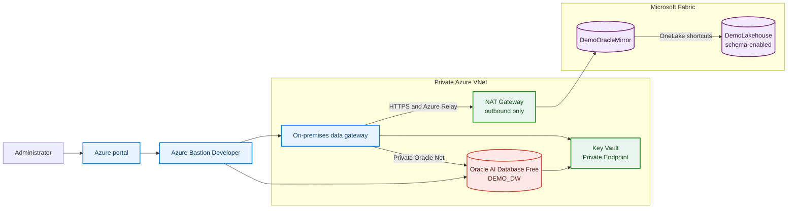
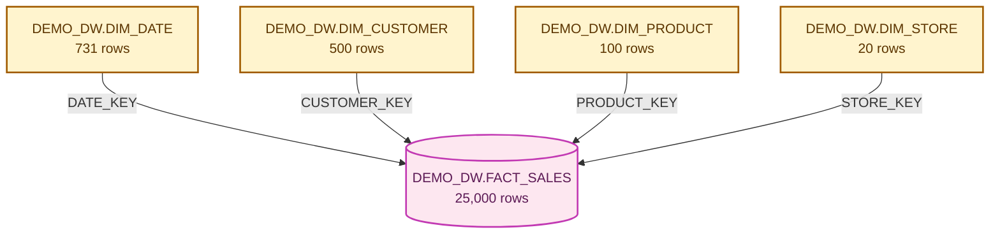

# Oracle to Fabric Demo

Private Oracle AI Database Free on Azure, mirrored into Microsoft Fabric and exposed through a schema-enabled Lakehouse.

## Summary

| | Result |
| --- | --- |
| Status | 🟢 Deployed and validated on September 15, 2026 |
| Data path | Oracle to private gateway to `DemoOracleMirror` to `DemoLakehouse` |
| Security | No public IP on either VM, Key Vault private, outbound-only NAT |
| Data | 5 Delta tables under the `DEMO_DW` Lakehouse schema |
| Volume | 25,000 sales rows plus four dimensions |
| Replication | Initial snapshot and live insert, update, and delete validated |
| Persistent cost | About 71 EUR per month while NAT, Private Endpoint, and disks remain |

No tenant ID, subscription ID, account, token, password, certificate, or recovery key is stored in Git.

[](docs/architecture/rendered/01-context.svg)

## 1. Architecture



<details>
<summary>Deployed components</summary>

| Layer | Resource |
| --- | --- |
| Azure region | Central US |
| VNet | `demo-oracle-vnet`, `10.60.0.0/16` |
| Oracle VM | `demo-oracle-vm`, Oracle Linux 9.8, `Standard_D2as_v7` |
| Gateway VM | `demo-fabric-gateway-vm`, Windows Server 2022, `Standard_D4as_v7` |
| Administration | Free Azure Bastion Developer |
| Secrets | Key Vault with public network access disabled |
| Egress | NAT Gateway with one outbound-only public IP |
| Oracle | Oracle AI Database 26ai Free, RPM installation |
| Gateway | `Demo Oracle Gateway`, version `3000.330.1` |
| Fabric connection | `Demo Oracle Connection` |
| Mirrored Database | `DemoOracleMirror` |
| Lakehouse | Schema-enabled `DemoLakehouse` |

</details>

<details>
<summary>Network and security</summary>

- neither VM has a public IP
- SSH, RDP, and Oracle Net have no inbound Internet path
- Bastion Developer uses the Azure portal and has no dedicated public IP
- Oracle Net is allowed only from the gateway subnet
- Key Vault is reached through a Private Endpoint
- credentials are generated during deployment
- the gateway uses a dedicated Fabric service principal
- one public IP is attached only to NAT Gateway for outbound traffic

The NAT address cannot accept unsolicited inbound connections. It is required because Oracle installation and the Fabric gateway must reach Oracle and Microsoft public endpoints.

</details>

<details>
<summary>Oracle and Fabric data path</summary>

Oracle runs in `ARCHIVELOG` mode with LogMiner and supplemental logging enabled.

The gateway uses the managed ODP.NET driver bundled with the current gateway release. `DemoOracleMirror` stores the replicated tables as Delta in OneLake.

`DemoLakehouse` was created with `enableSchemas=true`. Its shortcuts are under `Tables/DEMO_DW`, so Fabric catalogs them as tables instead of placing them under `Unidentified`.



</details>

### Installation

Prerequisites:

- Azure CLI authenticated on the target tenant
- Azure Owner and Fabric Administrator permissions during deployment
- existing `FGI-ORACLE` resource group
- existing `FGI-ORACLE` Fabric workspace on an active capacity
- Bicep and `sqlcmd` available locally

Tenant and subscription identifiers are passed at runtime and never written to tracked files.

```powershell
$env:AZURE_SUBSCRIPTION_ID = '<subscription-id>'
$env:AZURE_TENANT_ID = '<tenant-id>'

.\scripts\Deploy-Demo.ps1 `
  -SubscriptionId $env:AZURE_SUBSCRIPTION_ID `
  -TenantId $env:AZURE_TENANT_ID `
  -RunCdcValidation
```

The command is idempotent. Re-running it reconciles the existing deployment instead of creating a second environment.

<details>
<summary>What the installation command does</summary>

The orchestrator:

1. deploys or reconciles Azure with Bicep;
2. generates and stores secrets outside Git;
3. installs Oracle and the `DEMO_DW` schema;
4. installs and registers the gateway;
5. creates the Fabric connection, mirror, schema-enabled Lakehouse, and shortcuts;
6. validates Azure, Oracle, snapshot replication, and CDC.

</details>

<details>
<summary>Cost and Oracle Free limits</summary>

| Resource that bills while deployed | Approximate monthly retail cost |
| --- | ---: |
| NAT Gateway | 28 EUR |
| NAT public IP | 3 EUR |
| Key Vault Private Endpoint | 6 EUR |
| Managed disks | 34 EUR |
| **Persistent infrastructure** | **about 71 EUR** |

VM compute and Fabric capacity can be stopped.

Oracle AI Database Free has no license fee under the [Oracle Free Use Terms](https://www.oracle.com/downloads/licenses/oracle-free-license.html), but it is limited to:

- one installation per VM
- 2 CPUs
- 2 GB of Oracle memory
- 12 GB of user data
- no Oracle support
- no security patches

</details>

<details>
<summary>Architecture files</summary>

- [context view](docs/architecture/rendered/01-context.svg)
- [network topology](docs/architecture/rendered/02-network-topology.svg)
- [security flows](docs/architecture/rendered/03-security-flows.svg)
- [data flows](docs/architecture/rendered/04-data-flows.svg)
- [architecture inventory](docs/architecture/architecture-inventory.yaml)
- [diagram sources](docs/architecture/diagrams)

</details>

## 2. Test scenarios

### Live CDC in one command

```powershell
.\tests\Invoke-DemoCdcValidation.ps1
```

Expected result:

```text
CDC_VALID=true
CDC_BASELINE=0|Consumer|1|25000
CDC_RESULT=1|CDC_LIVE|0|25000
```

<details open>
<summary>Scenario A: insert, update, and delete</summary>

The script first restores and verifies a known baseline, then performs these Oracle changes:

1. inserts sales row `900000000000002`;
2. updates customer `2` to segment `CDC_LIVE`;
3. deletes sales row `24998`;
4. archives the current redo log;
5. polls `DemoLakehouse` until all changes are visible.

The result values mean:

| Value | Check |
| --- | --- |
| `1` | inserted row exists |
| `CDC_LIVE` | update reached Fabric |
| `0` | deleted row no longer exists |
| `25000` | fact table row count remains stable |

</details>

<details>
<summary>Scenario B: initial snapshot</summary>

Expected row counts in Oracle, `DemoOracleMirror`, and `DemoLakehouse`:

```text
DIM_DATE=731
DIM_CUSTOMER=500
DIM_PRODUCT=100
DIM_STORE=20
FACT_SALES=25000
```

The SQL endpoint exposes the shortcuts as:

```text
DEMO_DW.DIM_DATE
DEMO_DW.DIM_CUSTOMER
DEMO_DW.DIM_PRODUCT
DEMO_DW.DIM_STORE
DEMO_DW.FACT_SALES
```

</details>

<details>
<summary>Scenario C: Azure isolation</summary>

```powershell
.\tests\Validate-AzureDemo.ps1 `
  -SubscriptionId $env:AZURE_SUBSCRIPTION_ID
```

Expected result:

```text
AZURE_DEMO_VALID=true
WORKLOAD_PUBLIC_IP_COUNT=0
BASTION_SKU=Developer
NAT_PUBLIC_IP_COUNT=1
KEY_VAULT_PUBLIC_ACCESS=Disabled
```

</details>

<details>
<summary>Scenario D: Oracle health</summary>

The Oracle validation checks:

- instance and listener running
- `FREEPDB1` open in read-write mode
- `ARCHIVELOG` enabled
- database and table supplemental logging enabled
- data files stored on `/u02`
- mirror account present
- all five row counts correct

</details>

<details>
<summary>Repository map and commands</summary>

```text
infra/        Azure Bicep
scripts/      deployment and identity orchestration
oracle/       installation, schema, archive-log, and CDC scripts
fabric/       gateway and Fabric configuration
tests/        Azure and end-to-end validation
docs/         architecture inventory and rendered diagrams
```

| Command | Purpose |
| --- | --- |
| `scripts\Deploy-Demo.ps1` | deploy and validate the complete Demo |
| `scripts\Deploy-DemoFoundation.ps1` | deploy Azure and seed Key Vault |
| `scripts\Initialize-DemoIdentity.ps1` | create the gateway automation identity |
| `fabric\Configure-DemoFabric.ps1` | configure Fabric and schema-aware shortcuts |
| `tests\Validate-AzureDemo.ps1` | verify Azure isolation |
| `tests\Invoke-DemoCdcValidation.ps1` | prove live Oracle CDC |

</details>

<details>
<summary>Official sources</summary>

- [Oracle AI Database Free](https://www.oracle.com/database/free/)
- [Oracle Free Use Terms](https://www.oracle.com/downloads/licenses/oracle-free-license.html)
- [Oracle Mirroring in Microsoft Fabric](https://learn.microsoft.com/en-us/fabric/mirroring/oracle)
- [Oracle Mirroring limitations](https://learn.microsoft.com/en-us/fabric/mirroring/oracle-limitations)
- [On-premises data gateway communication](https://learn.microsoft.com/en-us/data-integration/gateway/service-gateway-communication)
- [Create a schema-enabled Lakehouse](https://learn.microsoft.com/en-us/rest/api/fabric/lakehouse/items/create-lakehouse)
- [OneLake shortcuts](https://learn.microsoft.com/en-us/rest/api/fabric/core/onelake-shortcuts/create-shortcut)

</details>
