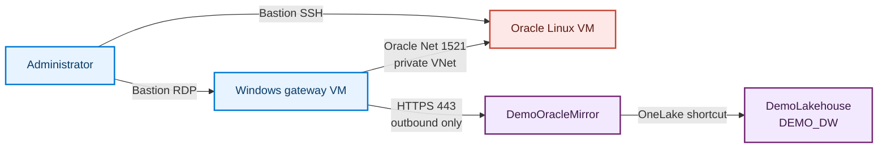
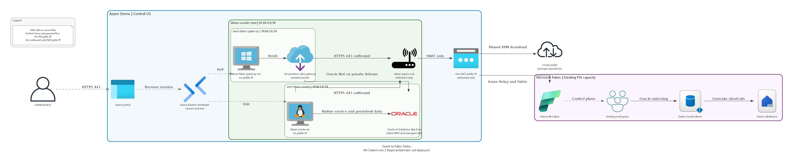

<p align="center">
  
</p>

<p align="center">
  <code>PRIVATE VNET</code>&nbsp;&nbsp;
  <code>0 VM PUBLIC IPS</code>&nbsp;&nbsp;
  <code>LIVE ORACLE CDC</code>&nbsp;&nbsp;
  <code>SCHEMA-ENABLED LAKEHOUSE</code>
</p>

<p align="center">
  <a href="#run-the-demo">Run the demo</a> ·
  <a href="#connect-to-oracle">Connect to Oracle</a> ·
  <a href="#architecture">Architecture</a> ·
  <a href="#deploy-from-scratch">Deploy</a>
</p>

# Oracle to Fabric Demo

This repo deploys Oracle AI Database Free on a private Azure Linux VM and mirrors five tables into Microsoft Fabric. The Windows VM beside it runs the gateway service. It is not where you work with Oracle.

## Run the demo

From PowerShell, in the repository root:

```powershell
.\tests\Invoke-DemoInsertScenario.ps1
```

The script inserts one row into `DEMO_DW.FACT_SALES`, archives the current redo log, waits for Fabric Mirroring, then confirms that the row reached `DemoLakehouse`.

Expected output:

```text
ORACLE_INSERTED=true
SALES_KEY=<generated-key>
WAITING_FOR_FABRIC=true
FABRIC_REPLICATED=true
FABRIC_TABLE=DEMO_DW.FACT_SALES
```

Use this for the demo. It needs no SSH session or portal work. Fabric can take several minutes to expose the new row, so the script waits for it.

## Connect to Oracle

For routine tests, do not open either VM. Run the insert scenario above.

When you want a real SQL*Plus session, connect **directly to `demo-oracle-vm` through Azure Bastion SSH**. The gateway VM is not a jump host. Open it through Bastion RDP only when you need to inspect the gateway service.

| Goal | Path |
| --- | --- |
| Insert a row and prove replication | Run `tests\Invoke-DemoInsertScenario.ps1` locally |
| Open an interactive Oracle shell | Bastion SSH to `demo-oracle-vm` |
| Inspect the Fabric gateway service | Bastion RDP to `demo-fabric-gateway-vm` |

<details>
<summary>Open an interactive SQL session with Bastion</summary>

Export the DPAPI-protected deployment key:

```powershell
.\scripts\Export-DemoSshKey.ps1
```

Then open `demo-oracle-vm` in Azure Portal and select **Connect > Bastion**:

```text
Authentication: SSH private key from local file
Username:       demoadmin
Private key:    use the path printed by the script
```

After Bastion opens the Linux shell:

```bash
sudo -u oracle env \
  ORACLE_HOME=/opt/oracle/product/26ai/dbhomeFree \
  ORACLE_SID=FREE \
  PATH=/opt/oracle/product/26ai/dbhomeFree/bin:/usr/bin \
  /opt/oracle/product/26ai/dbhomeFree/bin/sqlplus "/ as sysdba"
```

Paste this SQL:

```sql
alter session set container=FREEPDB1;

insert into DEMO_DW.FACT_SALES (
  SALES_KEY, DATE_KEY, CUSTOMER_KEY, PRODUCT_KEY, STORE_KEY,
  QUANTITY, UNIT_PRICE, SALES_AMOUNT, UPDATED_AT
)
select
  to_number(to_char(systimestamp, 'YYYYMMDDHH24MISSFF3')),
  20250102, 2, 2, 2, 1, 19.95, 19.95, sysdate
from dual;

commit;

alter session set container=CDB$ROOT;
alter system archive log current;
```

Delete the exported key after the Bastion session starts:

```powershell
Remove-Item "$env:TEMP\demo-oracle-ssh.key"
```

</details>

## Architecture



### What runs where

| Location | Role |
| --- | --- |
| `demo-oracle-vm` | Oracle Linux 9.8, Oracle AI Database Free, SQL*Plus, data files and archive logs |
| `demo-fabric-gateway-vm` | Windows Server 2022, on-premises data gateway, managed Oracle provider |
| `DemoOracleMirror` | Fabric Mirrored Database receiving the snapshot and Oracle CDC |
| `DemoLakehouse` | Schema-enabled Lakehouse with five shortcuts under `Tables/DEMO_DW` |

<details>
<summary>Open the detailed architecture diagram</summary>

[](docs/architecture/rendered/01-context.png)

[Self-contained SVG](docs/architecture/rendered/01-context.svg) ·
[PDF](docs/architecture/rendered/01-context.pdf) ·
[Network view](docs/architecture/rendered/02-network-topology.png) ·
[Security view](docs/architecture/rendered/03-security-flows.png) ·
[Data flow](docs/architecture/rendered/04-data-flows.png)

</details>

## Deploy from scratch

Prerequisites:

- Azure CLI authenticated on the target tenant
- Azure Owner and Fabric Administrator permissions during deployment
- an existing `FGI-ORACLE` resource group
- an existing `FGI-ORACLE` Fabric workspace on active capacity
- Bicep and `sqlcmd` installed locally

```powershell
$env:AZURE_SUBSCRIPTION_ID = '<subscription-id>'
$env:AZURE_TENANT_ID = '<tenant-id>'

.\scripts\Deploy-Demo.ps1 `
  -SubscriptionId $env:AZURE_SUBSCRIPTION_ID `
  -TenantId $env:AZURE_TENANT_ID `
  -RunCdcValidation
```

The script deploys Azure, installs Oracle, registers the gateway, creates the Fabric items, and validates the initial snapshot plus live CDC. You can run it again without creating a second environment.

No tenant ID, subscription ID, account, token, password, certificate, recovery key, or private key is stored in Git.

## Current deployment

| Area | Result |
| --- | --- |
| Azure | Private VNet, Bastion Developer, NAT egress, private Key Vault |
| Compute | Oracle Linux VM and Windows gateway VM, both without public IPs |
| Oracle | `DEMO_DW` star schema with four dimensions and `FACT_SALES` |
| Fabric | Connection, Mirrored Database, schema-enabled Lakehouse, five shortcuts |
| Validation | Initial snapshot, insert, update, delete, and repeatable live CDC |

<details>
<summary>Security and network details</summary>

- SSH, RDP, and Oracle Net have no inbound Internet path.
- Bastion Developer provides browser-based administration and still requires Azure authorization plus the VM credential.
- Oracle Net is allowed only from the gateway subnet.
- Key Vault public network access is disabled.
- The NAT public IP accepts no unsolicited inbound connection.
- The gateway uses a dedicated service principal.
- Credentials are generated during deployment and stored in Key Vault plus local DPAPI-protected state.

</details>

<details>
<summary>Cost and Oracle Free limits</summary>

Persistent infrastructure costs about 71 EUR per month while the NAT Gateway, NAT public IP, Key Vault Private Endpoint, and managed disks remain deployed. VM compute and Fabric capacity can be stopped.

Oracle AI Database Free has no license fee under the [Oracle Free Use Terms](https://www.oracle.com/downloads/licenses/oracle-free-license.html). Its main limits are 2 CPUs, 2 GB of Oracle memory, 12 GB of user data, one installation per VM, no support, and no security patches.

</details>

<details>
<summary>More validation commands</summary>

```powershell
# Insert, update, and delete through live CDC
.\tests\Invoke-DemoCdcValidation.ps1

# Validate Azure isolation
.\tests\Validate-AzureDemo.ps1 `
  -SubscriptionId $env:AZURE_SUBSCRIPTION_ID
```

Expected CDC result:

```text
CDC_VALID=true
CDC_BASELINE=0|Consumer|1|25000
CDC_RESULT=1|CDC_LIVE|0|25000
```

</details>

<details>
<summary>Repository map</summary>

```text
infra/        Azure Bicep
scripts/      deployment, identity, and connection helpers
oracle/       Oracle installation, validation, and CDC scripts
fabric/       gateway and Fabric configuration
tests/        simple insert and full end-to-end validation
docs/         architecture sources and rendered diagrams
```

</details>

<details>
<summary>Official documentation</summary>

- [Oracle AI Database Free](https://www.oracle.com/database/free/)
- [Oracle Free Use Terms](https://www.oracle.com/downloads/licenses/oracle-free-license.html)
- [Oracle Mirroring in Microsoft Fabric](https://learn.microsoft.com/en-us/fabric/mirroring/oracle)
- [Oracle Mirroring limitations](https://learn.microsoft.com/en-us/fabric/mirroring/oracle-limitations)
- [On-premises data gateway communication](https://learn.microsoft.com/en-us/data-integration/gateway/service-gateway-communication)
- [Create a schema-enabled Lakehouse](https://learn.microsoft.com/en-us/rest/api/fabric/lakehouse/items/create-lakehouse)
- [OneLake shortcuts](https://learn.microsoft.com/en-us/rest/api/fabric/core/onelake-shortcuts/create-shortcut)

</details>
