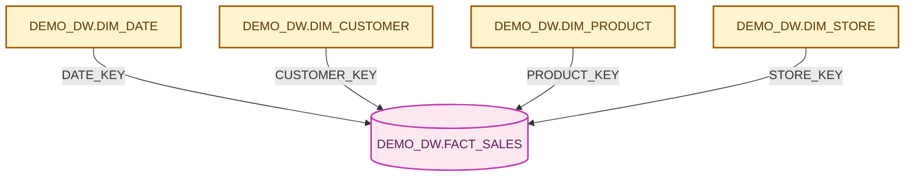
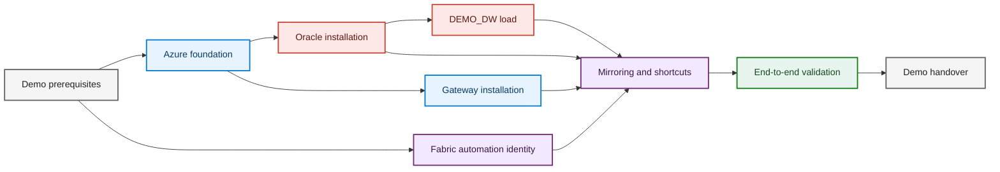

# Oracle to Fabric Demo

This repository describes and will automate a small end-to-end Oracle to Microsoft Fabric demonstration.

Oracle AI Database Free will run on a private Azure VM. A compact star schema will be mirrored into Microsoft Fabric through an on-premises data gateway, then exposed in a Lakehouse through OneLake shortcuts.

> Status on September 14, 2026: prerequisites verified, architecture documented, deployment not started.

## Deployment contract

After the explicit `GO`, the normal deployment path requires no portal click, credential entry, or manual configuration.

The automation will:

1. deploy the Azure network, VMs, disks, Key Vault, Bastion Developer, NAT Gateway, monitoring, and backup resources;
2. generate all passwords, recovery keys, and certificates and store them in Key Vault;
3. install Oracle AI Database Free from the public Oracle RPM package;
4. configure `ARCHIVELOG`, LogMiner, supplemental logging, and the `DEMO_DW` schema;
5. install and register the Fabric gateway without an interactive sign-in;
6. create the Oracle connection, Mirrored Database, Lakehouse, and OneLake shortcuts through Fabric APIs;
7. run network, snapshot, CDC, persistence, and reconciliation tests.

No tenant ID, subscription ID, account name, token, password, certificate, or recovery key will be committed to this repository.

The `GO` will also confirm use of Oracle AI Database Free under the [Oracle Free Use Terms](https://www.oracle.com/downloads/licenses/oracle-free-license.html). The only external events that could require intervention are an expired administrator activation, a Conditional Access challenge, or a cloud service failure.

## Verified environment

| Item | Verified state |
| --- | --- |
| Azure resource group | Existing, empty, and unlocked |
| Azure region | Central US selected to match the Fabric capacity |
| Fabric workspace | Existing and accessible with the Admin role |
| Fabric capacity | Active F16 in Central US |
| Fabric APIs | Workspaces, connections, gateways, and tenant settings accessible |
| Automation identities | Service principals are allowed for Fabric public and administrative APIs |
| Oracle Linux | Oracle Linux 9.8 Gen2 x64 image available |
| VM sizes | `Standard_D2as_v7`, `Standard_D4as_v7`, and `Standard_D8as_v7` available |
| VM quota | 100 vCPU available for the selected v7 families |
| Azure providers | Compute, Network, Key Vault, Storage, Monitor, Backup, Maintenance, and Fabric registered |
| Bicep | Version `0.47.16` installed |

## Naming

The existing Azure resource group and Fabric workspace keep their current names. Every new resource or Fabric item uses `Demo` or the `demo-` prefix.

| Component | Planned name |
| --- | --- |
| Project | Oracle to Fabric Demo |
| VNet | `demo-oracle-vnet` |
| Oracle VM | `demo-oracle-vm` |
| Gateway VM | `demo-fabric-gateway-vm` |
| Bastion | `demo-bastion` |
| NAT Gateway | `demo-egress-nat` |
| Key Vault | `demo-oracle-kv-<unique>` |
| Oracle schema | `DEMO_DW` |
| Mirrored Database | `Demo Oracle Mirror` |
| Lakehouse | `Demo Lakehouse` |

## Rendered architecture

The architecture views are generated with Python Diagrams and Graphviz. They use Azure service icons and official Microsoft Fabric icons.

[](docs/architecture/rendered/01-context.svg)

| View | SVG | PNG | PDF | Source |
| --- | --- | --- | --- | --- |
| Context | [Open](docs/architecture/rendered/01-context.svg) | [Open](docs/architecture/rendered/01-context.png) | [Open](docs/architecture/rendered/01-context.pdf) | [`01_context.py`](docs/architecture/diagrams/01_context.py) |
| Network topology | [Open](docs/architecture/rendered/02-network-topology.svg) | [Open](docs/architecture/rendered/02-network-topology.png) | [Open](docs/architecture/rendered/02-network-topology.pdf) | [`02_network_topology.py`](docs/architecture/diagrams/02_network_topology.py) |
| Security flows | [Open](docs/architecture/rendered/03-security-flows.svg) | [Open](docs/architecture/rendered/03-security-flows.png) | [Open](docs/architecture/rendered/03-security-flows.pdf) | [`03_security_flows.py`](docs/architecture/diagrams/03_security_flows.py) |
| Data flows | [Open](docs/architecture/rendered/04-data-flows.svg) | [Open](docs/architecture/rendered/04-data-flows.png) | [Open](docs/architecture/rendered/04-data-flows.pdf) | [`04_data_flows.py`](docs/architecture/diagrams/04_data_flows.py) |

The [architecture inventory](docs/architecture/architecture-inventory.yaml) is the source of truth for the diagrams. Sensitive environment identifiers are deliberately omitted.

## Architecture decisions

| Topic | Decision |
| --- | --- |
| Oracle installation | Install Oracle AI Database 26ai Free from the public Oracle Linux RPM package. No Oracle Container Registry token is required. |
| Oracle host | Use `Standard_D2as_v7`, Oracle Linux 9.8 Gen2 x64, and a dedicated managed data disk. |
| Gateway host | Start with `Standard_D4as_v7` for the small Demo data set. Scale to `D8as_v7` only if gateway measurements require it. |
| Administration | Use free Azure Bastion Developer through the Azure portal. It needs no VPN Gateway, public IP, or `AzureBastionSubnet`. |
| Workload ingress | Neither VM has a public IP. SSH, RDP, and Oracle Net are never exposed directly to the Internet. |
| Outbound access | Use NAT Gateway with one Standard public IP dedicated to outbound traffic. NAT does not accept unsolicited inbound connections. |
| Secrets | Generate credentials during deployment and store them in Key Vault through a Private Endpoint. |
| Fabric connection | Install a standard on-premises data gateway on the private Windows VM. |
| Fabric destination | Replicate the Oracle tables into `Demo Oracle Mirror`, which stores Delta tables in OneLake. |
| Lakehouse | Create `Demo Lakehouse` and add OneLake shortcuts to the mirrored tables. |
| Intended use | Demonstration only. Oracle AI Database Free is unsupported and receives no security patches. |

### One unavoidable public IP

There is no shared Azure egress service in the subscription. Oracle installation and the Fabric gateway both require outbound access to public Oracle and Microsoft endpoints.

The Demo therefore needs one public IP attached only to NAT Gateway. It is not attached to a VM or Bastion, has no inbound path, and cannot expose Oracle. Removing it would break package installation, gateway registration, and mirroring.

## Editable Mermaid architecture

```mermaid
flowchart LR
    Admin[Administrator]
    Portal[Azure portal]
    Bastion[Azure Bastion Developer<br/>shared and free]

    subgraph Azure["Azure Demo"]
        subgraph VNet["demo-oracle-vnet<br/>10.60.0.0/16"]
            subgraph OracleSubnet["snet-demo-oracle<br/>10.60.1.0/24"]
                OracleVM[demo-oracle-vm<br/>no public IP]
                OracleDB[(Oracle AI Database 26ai Free<br/>native RPM and managed disk)]
                OracleVM --> OracleDB
            end

            subgraph GatewaySubnet["snet-demo-gateway<br/>10.60.2.0/24"]
                GatewayVM[demo-fabric-gateway-vm<br/>no public IP]
                OPDG[On-premises data gateway<br/>Oracle Client for Microsoft Tools]
                GatewayVM --> OPDG
            end

            subgraph PrivateEndpointSubnet["snet-demo-private-endpoints<br/>10.60.3.0/24"]
                KeyVault[Key Vault Private Endpoint]
            end

            NAT[NAT Gateway<br/>outbound only]
        end

        NATIP[One Standard public IP<br/>outbound only]
    end

    subgraph Fabric["Microsoft Fabric"]
        Workspace[Existing workspace and F16 capacity]
        Mirror[(Demo Oracle Mirror)]
        SQLEndpoint[SQL analytics endpoint]
        Lakehouse[(Demo Lakehouse)]
        Workspace --> Mirror
        Mirror --> SQLEndpoint
        Mirror -->|OneLake shortcuts| Lakehouse
    end

    Admin -->|HTTPS 443| Portal --> Bastion
    Bastion -->|SSH| OracleVM
    Bastion -->|RDP| GatewayVM
    OPDG -->|Private Oracle Net| OracleDB
    OracleVM -->|HTTPS 443| NAT
    OPDG -->|HTTPS 443 and Azure Relay| NAT
    NAT --> NATIP --> Workspace
    OracleVM --> KeyVault
    GatewayVM --> KeyVault

    classDef oracle fill:#FDE8E7,stroke:#C74634,color:#5B1A12,stroke-width:2px;
    classDef azure fill:#E7F3FF,stroke:#0078D4,color:#083B66,stroke-width:2px;
    classDef security fill:#E8F5EE,stroke:#107C10,color:#164B1B,stroke-width:2px;
    classDef fabric fill:#F2E9FF,stroke:#742774,color:#3B1747,stroke-width:2px;
    classDef neutral fill:#F5F5F5,stroke:#616161,color:#212121,stroke-width:1px;

    class OracleVM,OracleDB oracle;
    class Portal,Bastion,GatewayVM,OPDG azure;
    class NAT,NATIP,KeyVault security;
    class Workspace,Mirror,SQLEndpoint,Lakehouse fabric;
    class Admin neutral;
```



The colors identify ownership: red for Oracle, blue for Azure services, green for security and egress controls, and purple for Fabric.

## Network layout

| Network | Address range | Purpose |
| --- | --- | --- |
| `demo-oracle-vnet` | `10.60.0.0/16` | Isolated Demo network |
| `snet-demo-oracle` | `10.60.1.0/24` | Oracle Linux VM and Oracle database |
| `snet-demo-gateway` | `10.60.2.0/24` | Windows VM and Fabric gateway |
| `snet-demo-private-endpoints` | `10.60.3.0/24` | Key Vault Private Endpoint |

The selected VNet range does not overlap the two VNets currently present in the subscription. The Demo creates no peering and no VPN connection.

### Security rules

- no public IP on either VM
- no public IP or dedicated subnet for Bastion Developer
- exactly one outbound-only public IP on NAT Gateway
- no inbound Internet rule for SSH, RDP, or Oracle Net
- Oracle Net allowed only from the gateway subnet
- Bastion Developer restricted to the approved administrator source address when supported
- managed identities for Key Vault access
- credentials, certificates, and recovery keys generated at deployment time
- separate NSGs for the Oracle, gateway, and Private Endpoint subnets
- gateway outbound traffic forced to HTTPS where supported
- network ports test executed after gateway registration

## Why the design uses a gateway

Oracle Mirroring currently supports the on-premises data gateway. The gateway reads Oracle over the private VNet and initiates outbound connections to Azure Relay and Fabric.

The following services do not replace that gateway:

- VNet data gateway, which is not documented as supported for Oracle Mirroring
- Fabric managed private endpoints
- Fabric Private Link

The gateway needs outbound access, but it never needs an inbound Internet port.

## Demo warehouse schema

The `DEMO_DW` schema is intentionally small.

| Table | Purpose | Target rows | Key |
| --- | --- | ---: | --- |
| `DEMO_DW.DIM_DATE` | two calendar years | 731 | `DATE_KEY` |
| `DEMO_DW.DIM_CUSTOMER` | synthetic customers and segments | 500 | `CUSTOMER_KEY` |
| `DEMO_DW.DIM_PRODUCT` | small product catalog | 100 | `PRODUCT_KEY` |
| `DEMO_DW.DIM_STORE` | stores and regions | 20 | `STORE_KEY` |
| `DEMO_DW.FACT_SALES` | sales linked to all dimensions | 25,000 | `SALES_KEY` |



The schema uses `NUMBER(p,s)` with explicit precision, `VARCHAR2`, `CHAR`, and `DATE`. Every mirrored table has a primary key. LOBs, object types, spatial types, and `NUMBER` columns without precision are excluded.

## Multi-agent delivery

| Agent | Responsibility |
| --- | --- |
| Azure platform | resource groups, identities, Key Vault, monitoring, backup |
| Network and security | VNet, subnets, NSGs, Bastion Developer, NAT, Private Endpoint |
| Oracle | VM, RPM installation, storage, LogMiner, backup, `DEMO_DW` |
| Fabric | unattended gateway registration, connection, mirror, Lakehouse, shortcuts |
| Validation | isolation, snapshot, CDC, persistence, recovery, cost |
| Reviewer | architecture, security, license, and final go/no-go |



## Delivery phases

### Phase 0: automation identity

- create a certificate-backed service principal
- add it to the existing Fabric API security group
- grant only the roles needed for the Demo
- store the certificate and gateway recovery key in Key Vault
- keep all environment identifiers outside tracked files

Exit gate: Azure, Fabric, and gateway APIs accept non-interactive authentication.

### Phase 1: Azure foundation

- deploy the Central US VNet and three subnets
- deploy Bastion Developer
- deploy NAT Gateway and its outbound-only public IP
- deploy Key Vault and its Private Endpoint
- deploy NSGs, route tables, monitoring, and backup resources

Exit gate: no workload has a public IP or inbound Internet path.

### Phase 2: Oracle and `DEMO_DW`

- deploy the Oracle Linux VM as `Standard_D2as_v7`
- attach the managed data disk
- download and verify the pinned Oracle AI Database Free RPM
- install and configure the database service
- generate Oracle administrator and mirroring credentials in Key Vault
- enable `ARCHIVELOG`, LogMiner, and supplemental logging
- create and load the five `DEMO_DW` tables

Exit gate: Oracle restarts without data loss and the listener is reachable only from approved private sources.

### Phase 3: gateway and Fabric

- deploy the Windows gateway VM as `Standard_D4as_v7`
- install Oracle Client for Microsoft Tools
- install the standard on-premises data gateway silently
- register the gateway with the certificate-backed service principal
- create the Oracle connection with credentials read from Key Vault
- create `Demo Oracle Mirror`
- create `Demo Lakehouse`
- create OneLake shortcuts to the five mirrored tables

Exit gate: all Demo tables are visible in the Mirrored Database, SQL analytics endpoint, and Lakehouse.

### Phase 4: validation

| Test | Expected evidence |
| --- | --- |
| Isolation | no VM public IP and no Internet ingress path |
| Bastion | browser sessions reach both private VMs |
| Persistence | Oracle data survives service and VM restarts |
| Snapshot | Oracle and Fabric return the same row counts and aggregates |
| CDC | one insert, update, and delete appear in Fabric |
| Lakehouse | all five shortcuts are readable from Spark and SQL |
| Recovery | replication resumes after a controlled gateway restart |
| Secrets | no credential or environment identifier exists in Git history |

Exit gate: every test passes without manual correction.

## Running cost while deployed

The Demo removes the VPN Gateway and paid Bastion. The remaining resources that keep charging while they exist are approximately:

| Resource | Monthly retail estimate |
| --- | ---: |
| NAT Gateway | 28 EUR |
| NAT public IP | 3 EUR |
| Key Vault Private Endpoint | 6 EUR |
| Managed disks | 34 EUR |
| **Persistent Demo infrastructure** | **about 71 EUR** |

VM compute and Fabric capacity can be stopped. NAT, its public IP, the Private Endpoint, and disks must be deleted to stop their charges completely.

## Constraints

- Oracle AI Database Free is licensed at no charge under the Oracle Free Use Terms.
- It is limited to one installation per VM, 2 CPUs, 2 GB of Oracle memory, and 12 GB of user data.
- It is unsupported and receives no security patches.
- Oracle Mirroring requires write mode, LogMiner, `ARCHIVELOG`, supplemental logging, and a standard on-premises data gateway.
- The gateway requires public outbound access to Microsoft endpoints.
- A mirrored table needs a primary key or unique index.
- A Mirrored Database supports up to 1,000 tables.
- Bastion Developer is free, shared, browser-only, and intended for dev/test use.

## Planned repository layout

```text
infra/
  environments/
  modules/
oracle/
  rpm/
  sql/
fabric/
  gateway/
  runbooks/
tests/
  integration/
docs/
  architecture/
  decisions/
```

## Completion criteria

The Demo is complete when:

1. all Azure and Fabric resources deploy without a manual step;
2. neither VM nor Oracle is directly exposed to the Internet;
3. `DEMO_DW` is persistent and reproducible;
4. all five tables replicate into `Demo Oracle Mirror`;
5. `Demo Lakehouse` reads them through OneLake shortcuts;
6. `INSERT`, `UPDATE`, and `DELETE` changes pass end-to-end validation;
7. the teardown removes every hourly resource and leaves no secret in the repository.

## Official sources

### Oracle

- [Oracle AI Database Free](https://www.oracle.com/database/free/)
- [Oracle Free Use Terms](https://www.oracle.com/downloads/licenses/oracle-free-license.html)
- [Install Oracle AI Database Free on Linux](https://docs.oracle.com/en/database/oracle/oracle-database/26/xeinl/installing-oracle-database-free.html)
- [Oracle AI Database 26ai Free restrictions](https://docs.oracle.com/en/database/oracle/oracle-database/26/xeinl/licensing-restrictions.html)
- [Oracle AI Database Free FAQ](https://www.oracle.com/database/free/faq/)

### Azure

- [Azure Bastion Developer](https://learn.microsoft.com/en-us/azure/bastion/quickstart-host-portal#developer-sku-free)
- [Azure Bastion SKU comparison](https://learn.microsoft.com/en-us/azure/bastion/bastion-sku-comparison)
- [Azure NAT Gateway](https://learn.microsoft.com/en-us/azure/nat-gateway/nat-overview)
- [Default outbound access for Azure VNets](https://learn.microsoft.com/en-us/azure/virtual-network/ip-services/default-outbound-access)

### Microsoft Fabric

- [Oracle Mirroring in Microsoft Fabric](https://learn.microsoft.com/en-us/fabric/mirroring/oracle)
- [Oracle Mirroring limitations](https://learn.microsoft.com/en-us/fabric/mirroring/oracle-limitations)
- [Configure Oracle Mirroring](https://learn.microsoft.com/en-us/fabric/mirroring/oracle-tutorial)
- [On-premises data gateway communication](https://learn.microsoft.com/en-us/data-integration/gateway/service-gateway-communication)
- [Data gateway PowerShell cmdlets](https://learn.microsoft.com/en-us/powershell/gateway/overview)
- [Create a Lakehouse shortcut to a Mirrored Database](https://learn.microsoft.com/en-us/fabric/mirroring/explore-onelake-shortcut)
- [Official Microsoft Fabric icons](https://learn.microsoft.com/en-us/fabric/fundamentals/icons)
