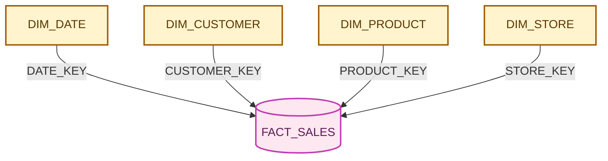
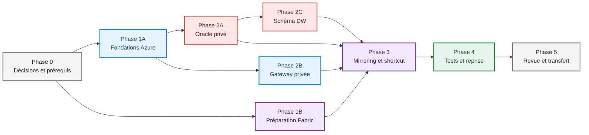

# Oracle Database Free vers Microsoft Fabric

Ce dépôt portera un environnement de démonstration privé dans Azure. Il hébergera Oracle AI Database Free sur une VM, répliquera un petit schéma en étoile vers Microsoft Fabric, puis exposera les tables dans un Lakehouse.

> Statut au 14 septembre 2026 : plan de développement uniquement. Aucune ressource Azure ou Fabric n'est encore créée.

## Décisions d'architecture

| Sujet | Décision |
| --- | --- |
| Image Oracle | Utiliser l'image conteneur officielle Oracle AI Database 26ai Free depuis Oracle Container Registry, avec une version et un digest figés. |
| Hôte | VM Oracle Linux x64 avec disque de données dédié. La VM n'aura pas d'adresse IP publique. |
| Administration | Azure Bastion Premium en mode private-only. L'accès depuis le poste local passera par VPN point-to-site ou ExpressRoute et par le client natif Bastion. |
| Réseau Oracle | Oracle écoute uniquement sur son IP privée. Le port Oracle Net sera autorisé depuis le sous-réseau de la gateway Fabric, pas depuis Internet. |
| Sortie réseau | NAT Gateway pour le PoC, ou Azure Firewall si le filtrage par FQDN et la journalisation centralisée sont requis. |
| Connexion Fabric | On-premises data gateway standard installée sur une VM Windows dédiée dans le VNet. C'est la méthode actuellement prise en charge pour Oracle Mirroring. |
| Destination Fabric | Un Mirrored Database réplique Oracle dans OneLake et fournit un SQL analytics endpoint. |
| Lakehouse | Un shortcut OneLake rend les tables du Mirrored Database visibles dans le Lakehouse sans créer une seconde copie. |
| Private Endpoint Fabric | Il ne remplace pas la gateway Oracle. Fabric Private Link sera traité séparément si la politique du tenant impose un accès privé aux interfaces Fabric. |
| Usage | Oracle AI Database Free convient à ce PoC. Une charge de production devra utiliser une édition Oracle prise en charge et corrigée. |

Le lien fourni ne correspond pas à une image Azure Marketplace prête à déployer. Le plan retient une VM Oracle Linux depuis Azure Marketplace, puis l'image officielle `container-registry.oracle.com/database/free` exécutée avec Podman. L'image sera téléchargée par une sortie contrôlée et ne sera pas recopiée dans Azure Container Registry sans validation préalable des conditions Oracle.

## Architecture cible

```mermaid
flowchart LR
    Admin[Poste d'administration]
    PrivateAccess[VPN P2S ou ExpressRoute]

    subgraph Azure["Tenant Azure"]
        subgraph VNet["VNet privé"]
            Bastion[Azure Bastion Premium<br/>private-only]

            subgraph OracleSubnet["Sous-réseau Oracle"]
                OracleVM[VM Oracle Linux<br/>sans IP publique]
                OracleDB[(Oracle AI Database 26ai Free<br/>conteneur + disque managé)]
                OracleVM --> OracleDB
            end

            subgraph GatewaySubnet["Sous-réseau Data Gateway"]
                GatewayVM[VM Windows dédiée<br/>sans IP publique]
                OPDG[On-premises data gateway<br/>Oracle Client for Microsoft Tools]
                GatewayVM --> OPDG
            end

            Egress[Sortie contrôlée<br/>NAT Gateway ou Azure Firewall]
            KeyVault[Key Vault<br/>Private Endpoint]
        end
    end

    subgraph Fabric["Microsoft Fabric"]
        Workspace[Workspace sur capacité Fabric]
        Mirror[(Mirrored Database)]
        SQLEndpoint[SQL analytics endpoint]
        Lakehouse[(Lakehouse)]
        Workspace --> Mirror
        Mirror --> SQLEndpoint
        Mirror -->|Shortcut OneLake| Lakehouse
    end

    Admin --> PrivateAccess --> Bastion
    Bastion -->|SSH privé| OracleVM
    Bastion -->|RDP privé| GatewayVM
    OPDG -->|Oracle Net privé| OracleDB
    OracleVM -->|Pull initial et mises à jour| Egress
    OPDG -->|HTTPS et Azure Relay sortants| Egress
    Egress --> Workspace
    OracleVM --> KeyVault
    GatewayVM --> KeyVault

    classDef oracle fill:#FDE8E7,stroke:#C74634,color:#5B1A12,stroke-width:2px;
    classDef azure fill:#E7F3FF,stroke:#0078D4,color:#083B66,stroke-width:2px;
    classDef security fill:#E8F5EE,stroke:#107C10,color:#164B1B,stroke-width:2px;
    classDef fabric fill:#F2E9FF,stroke:#742774,color:#3B1747,stroke-width:2px;
    classDef neutral fill:#F5F5F5,stroke:#616161,color:#212121,stroke-width:1px;

    class OracleVM,OracleDB oracle;
    class Bastion,GatewayVM,OPDG azure;
    class PrivateAccess,Egress,KeyVault security;
    class Workspace,Mirror,SQLEndpoint,Lakehouse fabric;
    class Admin neutral;
```



Les couleurs servent à lire la frontière technique : rouge pour Oracle, bleu pour les ressources Azure, vert pour les contrôles réseau et violet pour Fabric.

### Pourquoi une gateway et pas un Private Endpoint

Oracle est hébergé sur une VM avec une carte réseau privée. Il n'a donc pas besoin d'un Private Endpoint Azure pour être privé.

Oracle Mirroring dans Fabric prend actuellement en charge l'On-premises data gateway. La gateway se connecte à Oracle sur le réseau privé, puis initie elle-même les connexions sortantes vers Azure Relay et Fabric. Elle n'a besoin d'aucun port entrant depuis Internet.

Les options suivantes ne seront pas utilisées comme chemin de réplication :

- VNet data gateway, non documentée comme prise en charge pour Oracle Mirroring
- Managed Private Endpoint Fabric, qui ne remplace pas l'On-premises data gateway pour ce scénario
- Fabric Private Link, qui protège l'accès aux surfaces Fabric mais ne fournit pas la liaison source Oracle

L'activation de Fabric Private Link restera un gate distinct. L'enregistrement ou la restauration d'une gateway peut demander un séquencement particulier lorsque Private Link est actif dans le tenant.

## Découpage réseau prévu

| Sous-réseau | Rôle | Flux autorisés |
| --- | --- | --- |
| `AzureBastionSubnet` | Bastion Premium private-only, préfixe `/26` ou plus large | HTTPS privé depuis le réseau d'administration, SSH et RDP vers les VMs cibles |
| `snet-oracle` | VM Oracle Linux et Oracle Database Free | Oracle Net depuis `snet-gateway`, SSH depuis Bastion, sortie contrôlée pour l'image et les mises à jour |
| `snet-gateway` | VM Windows et On-premises data gateway | Oracle Net vers `snet-oracle`, RDP depuis Bastion, HTTPS et Azure Relay en sortie |
| `snet-private-endpoints` | Key Vault et futurs services PaaS privés | Résolution DNS privée et accès depuis les VMs autorisées |
| `GatewaySubnet` | Azure VPN Gateway si le VPN point-to-site est retenu | Accès chiffré depuis le poste d'administration |

Les sous-réseaux seront déclarés privés avec une méthode de sortie explicite. Depuis les API Azure postérieures au 31 mars 2026, les nouveaux VNets utilisent ce comportement par défaut.

### Règles de sécurité

- aucune IP publique sur les cartes réseau des VMs
- aucun accès SSH, RDP ou Oracle Net depuis Internet
- Oracle Net autorisé uniquement de la gateway Fabric vers Oracle
- administration uniquement via Bastion et le réseau privé
- identités managées pour l'accès aux services Azure
- secrets Oracle et clé de récupération de la gateway stockés dans Key Vault
- NSG distinct par sous-réseau avec journalisation des refus
- sortie Internet limitée aux domaines Oracle et Microsoft nécessaires
- test périodique des ports depuis l'application On-premises data gateway

## Schéma warehouse de démonstration

Le schéma `DW` restera volontairement petit. Les volumes ci-dessous sont des cibles de génération, pas des limites du produit.

| Table | Rôle | Volume cible | Clé |
| --- | --- | ---: | --- |
| `DW.DIM_DATE` | calendrier sur deux années | 731 lignes | `DATE_KEY` |
| `DW.DIM_CUSTOMER` | clients fictifs et segments | 500 lignes | `CUSTOMER_KEY` |
| `DW.DIM_PRODUCT` | catalogue simple | 100 lignes | `PRODUCT_KEY` |
| `DW.DIM_STORE` | points de vente et régions | 20 lignes | `STORE_KEY` |
| `DW.FACT_SALES` | ventes reliées aux dimensions | 25 000 lignes | `SALES_KEY` |



Le modèle utilisera des types simples pris en charge par le mirroring : `NUMBER(p,s)` avec précision explicite, `VARCHAR2`, `CHAR` et `DATE`. Chaque table aura une clé primaire. Les LOB, objets, types spatiaux et colonnes `NUMBER` sans précision seront exclus du PoC.

Le jeu de données permettra de tester un snapshot initial, puis des `INSERT`, `UPDATE` et `DELETE` sur les dimensions et la table de faits.

## Plan de développement multi-agent

Chaque agent possède un périmètre clair. Les agents produisent leurs changements sur des branches séparées, avec une revue croisée avant intégration.

| Agent | Responsabilité | Livrables prévus |
| --- | --- | --- |
| Agent plateforme Azure | conventions, groupes de ressources, identités, Key Vault, supervision | modules IaC communs et paramètres d'environnement |
| Agent réseau et sécurité | VNet, subnets, NSG, Bastion, VPN, DNS et sortie contrôlée | modules réseau, matrice de flux et contrôles de conformité |
| Agent Oracle | VM Linux, stockage, Podman, image Oracle, configuration LogMiner et sauvegarde | automatisation de l'hôte, configuration de la base et runbook DBA |
| Agent modèle de données | schéma `DW`, génération de données et requêtes de contrôle | scripts SQL idempotents et contrôles de qualité |
| Agent Fabric | VM gateway, OPDG, pilote Oracle, Mirrored Database, Lakehouse et shortcut | procédures Fabric, configuration de connexion et supervision |
| Agent validation | tests réseau, persistance, snapshot, CDC, reprise et coûts | tests automatisés, preuves d'exécution et rapport final |
| Agent reviewer | revue architecture, sécurité, licences et cohérence documentaire | décision go/no-go et liste des écarts |

### Ordonnancement



Les phases 1A et 1B démarrent en parallèle. Après la création du VNet, les agents Oracle, gateway et modèle de données peuvent avancer sans attendre la configuration finale du mirroring.

## Phases et gates

### Phase 0 : cadrage

- choisir la souscription, la région Azure et la région Fabric
- confirmer les quotas VM, la capacité Fabric et les rôles du workspace
- accepter les conditions Oracle Container Registry avec un compte dédié
- confirmer VPN point-to-site ou ExpressRoute pour joindre Bastion private-only
- valider les plages IP et les conventions de nommage
- décider entre NAT Gateway et Azure Firewall

Gate de sortie : le poste d'administration dispose d'un chemin privé prévu vers le VNet, et les coûts récurrents sont acceptés.

### Phase 1 : fondations privées

- créer les groupes de ressources et les identités managées
- créer le VNet, les sous-réseaux privés, les NSG, les tables de routage et le DNS
- déployer Bastion Premium private-only
- déployer le VPN si nécessaire
- déployer Key Vault avec Private Endpoint
- configurer la sortie explicite et la supervision

Gate de sortie : aucune VM ne peut recevoir une IP publique et les chemins d'administration sont privés.

### Phase 2 : Oracle et schéma `DW`

- déployer une VM Oracle Linux x64 avec 2 vCPU, une mémoire hôte suffisante et un disque de données séparé
- tirer une version précise de l'image Oracle Database Free et conserver son digest
- monter les données Oracle sur le disque managé pour survivre au remplacement du conteneur
- activer `ARCHIVELOG`, LogMiner et la journalisation supplémentaire
- créer un utilisateur dédié au mirroring avec les permissions documentées
- créer les cinq tables du schéma en étoile et charger les volumes cibles
- définir une rétention des archive logs compatible avec les arrêts de la gateway

Gate de sortie : la base redémarre sans perte de données, le listener reste privé et chaque table possède une clé primaire.

### Phase 3 : gateway et Fabric

- déployer une VM Windows dédiée dans `snet-gateway`
- installer la dernière On-premises data gateway standard
- installer la dernière version Oracle Client for Microsoft Tools
- vérifier la résolution DNS et la connexion Oracle privée
- enregistrer la gateway et exécuter le test réseau intégré
- créer le Workspace et le Lakehouse sur une capacité Fabric active
- créer la connexion Oracle avec le compte de mirroring
- créer le Mirrored Database et sélectionner les tables `DW`
- attendre la fin du snapshot initial
- créer les shortcuts OneLake dans la zone `Tables` du Lakehouse

Gate de sortie : les cinq tables sont visibles dans le Mirrored Database, le SQL analytics endpoint et le Lakehouse.

### Phase 4 : validation

| Test | Preuve attendue |
| --- | --- |
| Isolation | inventaire Azure sans IP publique sur les VMs et refus des connexions entrantes Internet |
| Administration | connexion au Linux et à Windows via le client natif Bastion |
| Persistance Oracle | données intactes après redémarrage du conteneur et de la VM |
| Snapshot | mêmes comptes de lignes et mêmes agrégats de ventes dans Oracle et Fabric |
| CDC | un ajout, une modification et une suppression visibles dans Fabric |
| Lakehouse | lecture des cinq shortcuts depuis Spark et le SQL analytics endpoint |
| Reprise | reprise de la réplication après redémarrage contrôlé de la gateway |
| Observabilité | statut des tables, erreurs et latence consultables dans les journaux Fabric |
| Coûts | estimation mensuelle documentée pour Bastion, VPN, VMs, disques, sortie et capacité Fabric |

Gate de sortie : aucune table n'est en erreur, aucun reseed inattendu n'est observé et les écarts de données sont nuls.

### Phase 5 : durcissement et transfert

- définir les sauvegardes Oracle et tester une restauration
- documenter les mises à jour mensuelles de la gateway et du client Oracle
- ajouter une seconde VM gateway si la haute disponibilité est requise
- finaliser les alertes Azure Monitor et Fabric
- revoir les privilèges Oracle, Azure et Fabric
- évaluer Fabric Private Link sans modifier le chemin de réplication Oracle
- rédiger les procédures de démarrage, arrêt, reprise et suppression du PoC

## Arborescence prévue

Cette arborescence décrit les futurs livrables. Elle ne sera créée qu'au début de l'implémentation.

```text
infra/
  environments/
  modules/
oracle/
  container/
  sql/
fabric/
  gateway/
  runbooks/
tests/
  integration/
docs/
  decisions/
```

## Contraintes à garder visibles

- Oracle AI Database Free limite l'instance à 2 CPU, 2 Go de mémoire de base et 12 Go de données utilisateur.
- Oracle AI Database Free ne fournit pas le niveau de support et de correctifs attendu pour une production.
- Oracle Mirroring demande Oracle 10 ou supérieur, une base en écriture, LogMiner, `ARCHIVELOG` et la journalisation supplémentaire.
- Oracle Mirroring accepte au maximum 1 000 tables par Mirrored Database.
- une table doit avoir une clé primaire ou un index unique
- les changements de type de colonne ne sont pas pris en charge
- la gateway doit joindre Oracle en privé et Azure Relay en sortie
- un réseau sans aucune sortie vers les services Microsoft n'est pas compatible avec cette architecture
- le Mirrored Database est la cible de réplication, le Lakehouse la consomme par shortcut
- Bastion Premium private-only a un coût horaire même lorsque personne ne l'utilise

## Critères de fin

Le PoC sera terminé lorsque :

1. aucune VM ni base Oracle n'est exposée directement à Internet ;
2. l'administration fonctionne depuis le poste local par un chemin privé ;
3. le schéma `DW` est persistant et reproductible ;
4. les cinq tables sont répliquées dans le Mirrored Database ;
5. le Lakehouse lit ces tables par shortcuts OneLake ;
6. les opérations `INSERT`, `UPDATE` et `DELETE` sont vérifiées de bout en bout ;
7. les coûts, limites, sauvegardes et procédures de reprise sont documentés.

## Sources officielles

### Oracle

- [Oracle AI Database Free](https://www.oracle.com/database/free/)
- [Oracle Database Free dans Oracle Container Registry](https://container-registry.oracle.com/ords/ocr/ba/database/free)
- [Oracle Database container images](https://github.com/oracle/docker-images/tree/main/OracleDatabase/SingleInstance)
- [Oracle AI Database 26ai Free, restrictions de licence et de ressources](https://docs.oracle.com/en/database/oracle/oracle-database/26/xeinl/licensing-restrictions.html)
- [Oracle AI Database Free FAQ](https://www.oracle.com/database/free/faq/)

### Azure

- [Déployer Azure Bastion en private-only](https://learn.microsoft.com/en-us/azure/bastion/private-only-deployment)
- [Paramètres Azure Bastion](https://learn.microsoft.com/en-us/azure/bastion/configuration-settings)
- [Accès sortant par défaut des VNets Azure](https://learn.microsoft.com/en-us/azure/virtual-network/ip-services/default-outbound-access)
- [Azure NAT Gateway](https://learn.microsoft.com/en-us/azure/nat-gateway/nat-overview)

### Microsoft Fabric

- [Oracle Mirroring dans Microsoft Fabric](https://learn.microsoft.com/en-us/fabric/mirroring/oracle)
- [Limites Oracle Mirroring](https://learn.microsoft.com/en-us/fabric/mirroring/oracle-limitations)
- [Configurer Oracle Mirroring](https://learn.microsoft.com/en-us/fabric/mirroring/oracle-tutorial)
- [Communication de l'On-premises data gateway](https://learn.microsoft.com/en-us/data-integration/gateway/service-gateway-communication)
- [Créer un shortcut du Mirrored Database vers un Lakehouse](https://learn.microsoft.com/en-us/fabric/mirroring/explore-onelake-shortcut)
